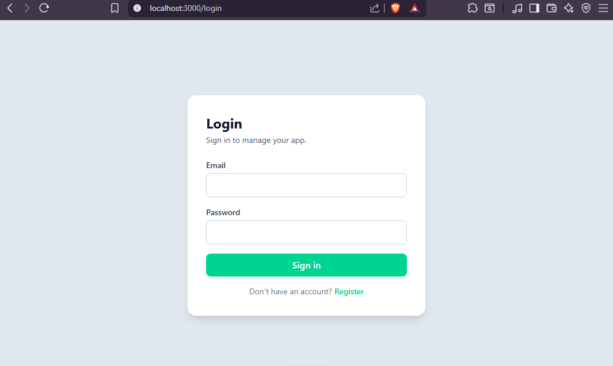
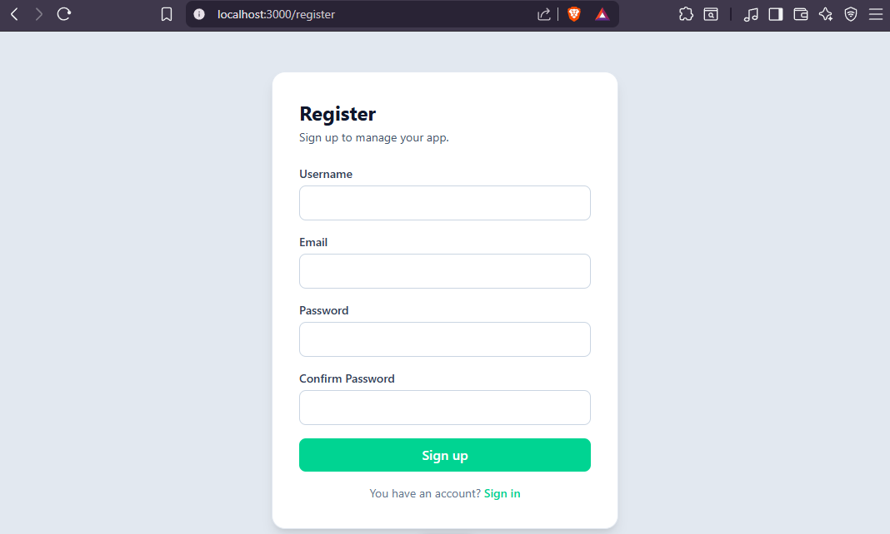

# Spring Boot + Vue JWT Starter

A fullstack starter template with simple JWT authentication.

- **Backend:** Spring Boot, Spring Security, JWT, JPA, PostgreSQL
- **Frontend:** Vue 3, TypeScript, Vite, Pinia, Vue Router

Use this project to avoid rebuilding auth basics from scratch.

## Preview




## Quick Start (Docker First)

Run everything together (PostgreSQL + backend + frontend):

```bash
docker compose --profile fullstack up --build
```

Services:
- Frontend: http://localhost:3000
- Backend: http://localhost:8080
- PostgreSQL: localhost:5432

## Local Development

### 1) Copy the environment file

```bash
cp .env.example .env
```

Edit `.env` if needed (DB credentials, JWT secret, etc.).

### 2) Database only

```bash
docker compose --profile db up -d
```

### 3) Backend

From the `backend` folder:

```bash
./gradlew bootRun
```

> No tests are implemented. To build without running tests: `./gradlew build -x test`

### 4) Frontend

From the `frontend` folder:

```bash
bun install
bun run dev
```

> npm and pnpm also work if you don't have Bun installed.

Frontend: http://localhost:3000

## Project Structure

- `backend/` — REST API and JWT auth
- `frontend/` — Vue app with login/register flow
- `docker-compose.yml` — PostgreSQL, backend, and frontend services

## Main Endpoints

| Method | Endpoint       |
|--------|----------------|
| POST   | /auth/register |
| POST   | /auth/login    |

## Environment Variables

Copy `.env.example` to `.env` and adjust as needed.

```env
# Database
DB_URL=jdbc:postgresql://postgres:5432/db
DB_USERNAME=postgres
DB_PASSWORD=postgres
DB_NAME=db

# JWT
JWT_SECRET=your_jwt_secret_here

# Frontend
VITE_API_URL=http://localhost:8080
```

## Java Version Notes

- This template is built and tested with **Java 25**.
- The Docker image also uses Java 25.
- **Java 21+ should work**, but you'll need to update the `languageVersion` in `backend/build.gradle`:
```groovy
  languageVersion = JavaLanguageVersion.of(21) // or 22, 23, etc.
```

## Notes

- This is a starter template — not production-ready as-is.
- Extend it with roles/permissions, refresh tokens, and business logic as needed.